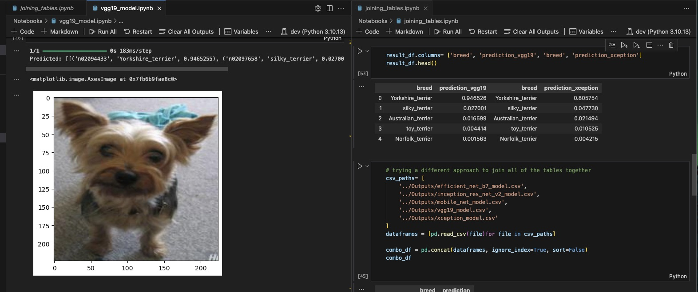
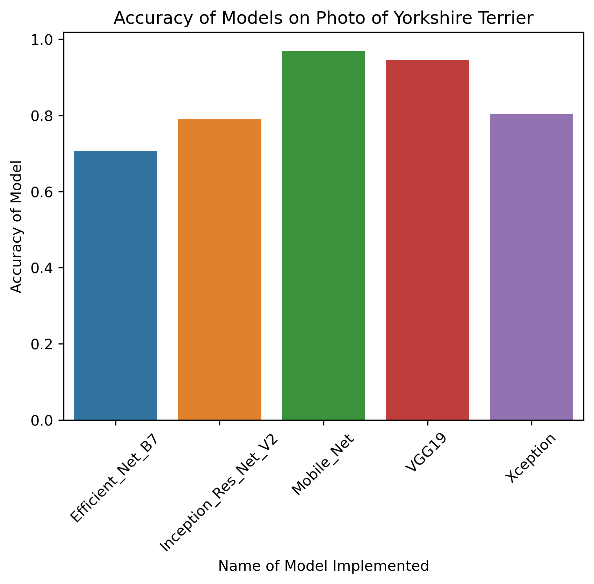
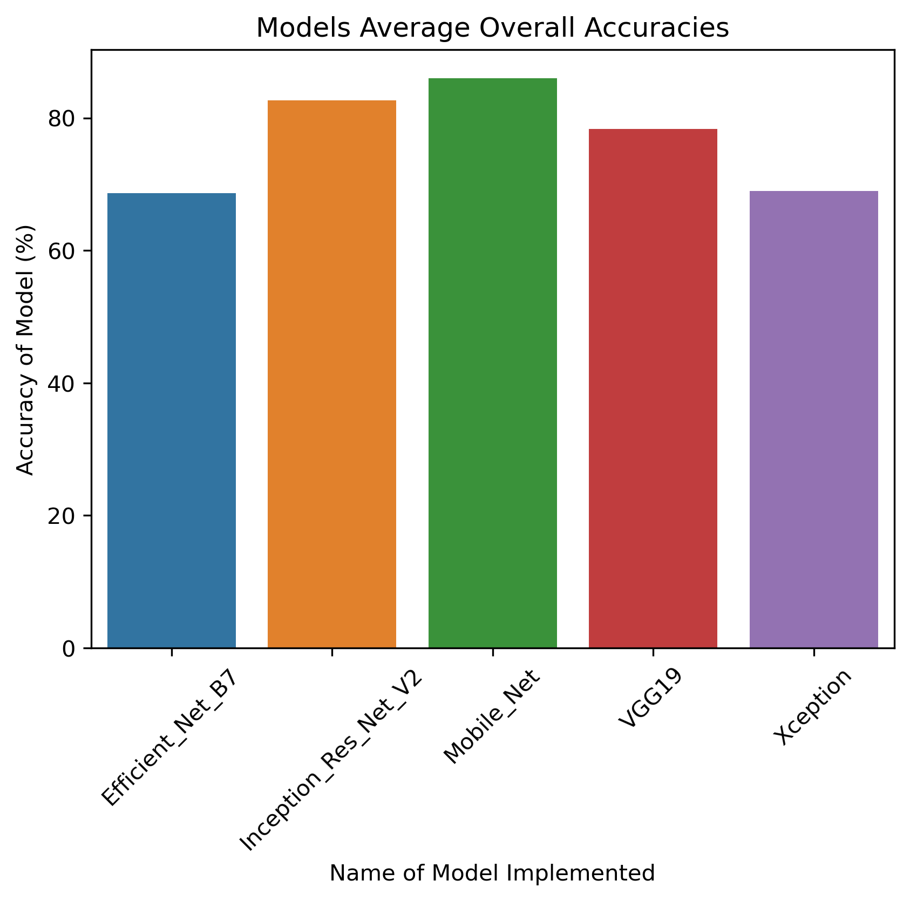

# K9_Classification

## Goals
The purpose is to to create machine learning models to identify the life span of a dog and identify the breed of a given dog.
* Binary Classification Models were used to predict the longevity.
  * Neural Network Model
  * Random Forest Model
  * Simple Vector Machine (SVM)
* Image Classification was made by using Convolutional Neural Network (CNN) Model to identify the dog breed.
  * Pretrained Models used:
    * VGG19
    * Xception
    * Efficient Net B7
    * Inception Res Net V2
    * Mobile Net
  
### Convolutional Neural Network Model / Image Classification
The objective of this part of the repository is to generate a CNN model to train on a image dataset of dogs to predict which specific breed it is given. Secondly,
an analysis was performed to determine which of the five pre-trained keras models performs best with making predictions of specific dog breeds given. Details of this section
can be found below.

## Dependencies utilized:
* PySpark
* SQL
* Pandas
* Tensorflow
* Sklearn
* NumPy
* Matplotlib
* Scikit-Learn
* SQL and SQLite

# Binary Classification

## Overview
The purpose of this section is to train and evaluate various binary classification models to evaluate the accuracy predicting a dog's lifespan.  

Factors that determined longevity:
* dog breed
* country of origin
* fur color
* height
* eye color
* character traits
* common health problems  

There were a total of 117 values in the dataset used to measure accuracy. First, the data was cleaned for sql queries. Three different temporary views were created: traits, health, and dog_breeds. The purpose of this section was to evaluate the best way to optimize results. Can you just create a temporary view or would it be better to cache the table or use parquet?  

Next, the data was cleaned again for binary classification. Using PySpark, the values in columns character traits and common health problems were exploded then split into new columns. This allowed for more factors to predict longevity for dogs, which consisted of 38 new columns from character traits and 29 from common health problems. After cleaning the data, the dataframe was converted back to pandas for binary classification models that included: neural network model, random forest model, and support vector machine (svm).  

Within each model, the data was seperated into labels (longevity(yrs)_class) and features (all data excluding longevity(yrs)_class). These factors were used to split into training and testing datasets to create multiple binary classification models stated above. From testing each model, we wanted an accuracy of at least 70%.

## Results & Analysis

### Optimize SQL Queries
We will look at one table to identify whether or not it would be better to cache or use parquet for this dataset.  
  
From creating a temporary view from the table traits, the query to identify the top 5 common character traits among dogs had a runtime of 1.40 seconds.  
  
After caching the table traits, the runtime slightly decreased resulting in 1.30 seconds.  
Caching datasets are stored in local memory, so it's better for small data. Since this dataset only had 117 features, it is more ideal to cache the dataset to get a quicker runtime since it is easier to access stored data.  
  
Using parquet, the runtime increased resulting in 1.73 seconds.  
Parquet is ideally used to optimize disk storage, so this is used for larger datasets. Since this dataset is smaller, caching would be preferred over parquet.  

### Neural Network Model
For this model, the neuron units were 1 and used a sigmoid activation layer. The layers used were 8(relu), 16(sigmoid), and 32(sigmoid) with 50 epochs.  
  
The predictive accuracy was 20% with a loss of -3.6601.  
  

The neural network created had a low accuracy of 20%. This model is harder to train on small datasets because there are not many variables for test/training. The dataset consisted of 117 total variables and since we tested on 20%, that resulted in only 24 test and 93 training. In addition to not having many variables for testing, neural networks can go through multiple otpimizations such as: changing neuron values, hidden layers, feature values, binning values, and epoch values. With all these forms of optimizations, it's harder to create a neural network model with high accuracy.

### Random Forest Model
This model used a test size of 20% abd randon state of 42. The accuracy of the model resulted in 92%.  
  
  
Below is a random forest tree visualization of the first test variable (playful).
  

The Random Forest Model resulted in a high accuracy of 92%. The advantages of this model are reduced overfitting, able to handble missing values/outliers, and reduced biased by having multiple predictions. Since our model is smaller, it allows for each testing variable to have multiple outcomes from using the training variables. It is possible that with creating our own model, like the nerual network above, there might have been overfitting or bias.  

### Support Vector Machine
This model used a test size of 20% and random state of 42. The kernel used was 'linear', since the model was binary.  
The accuracy of the model resulted in 96%.  
  
  
Below is a graph of the decision boundary and all of the outcomes. The line was fairly accurate in splitting the data as we can see from the results above.  
  

The Support Vector Machine (SVM) resulted in the highest accuraxt of 96%. The advantages of using SVMs sre its robust to overfitting (similar to random forest), used for small to medium sized datasets, and has multiple kernels to allow nonlinear decision boundaries. Since the dataset used was small with only 117 features, SVMs are the ideal binary classification model to use for this specific dataset.  

# Image Classification 

Within this section of the repo you will find numerous python scripts analyzing, standardizing and building Convulutional Neural Network Models
based on a dataset of images of dog breeds. 

## Dependencies utilized:
* Tensorflow
* Scikit-Learn
* NumPy
* Matplotlib
* Seaborn
* Pandas
* SQL and SQLite

### Implementation

Since the Dataset containing images of assorted dog breeds was already cropped and cleaned (Resources/cropped), a lot of the data preprocessing time was reduced. However, implementing a CNN model and achieving an accuracy of 75% on the given data was a challenge. Initially achieving a Validation accuracy score of 13%, a different approach was considered; thus the decision of integrating the xception model was made and immediately made a significant impact on Validation accuracy even with just ten epochs while training the model (score of 24%). The script with the xception model applied can be found within the same notebook mentioned before. 

With that, a final approach was attempted. Implementing Standard Scaling to the model. While not common in CNN models, an attempt to optimized the personal model was attempted and achieved even less considerable results, with a validation accuracy of less than 1%. 

## Analyzing Keras Applications Pre-Built Models

After studying different models from the given url (https://keras.io/api/applications/), the project took a turn to see which pre-trained model from ImageNet dataset could classify the images in our dataset best. 3 sample photos were chosen of a Beagle, a Yorkshire Terrier, and a Golden Retriever. 

### Pre-Trained Models Analyzed

* EfficientNetB7
* InceptionsResNetV2
* MobileNet
* VGG19
* Xception

Given the three sample photos to each pre-trained models, prediction scores of each breed of dog were recorded and ingested into Pandas Dataframes which can be found under the Notebooks folder (efficient_net_b7_model.ipynb, inception_res_net_v2.ipynb, mobile_net_model.ipynb, vgg19_model.ipynb, and xception_model.ipynb).

 5 dataframes were written to csv files and were then initialized into a SQLite database (found in joining_tables.ipynb). The dataframes were then joined together to draw conclusive results(as seen above) as to which pre-trained model worked best with our given data. 

Note, the MobileNet model performed best on the given photo of just the yorkshire terrier, while the VGG19 model predicted the photo second best out of the given dataset. 

Before the final graph of showing over all best accuracy of predictions of the dog breeds, a new data frame had to be created as can be seen below. 

In the graph above lists the average prediction accuracies achieved by each pre-trained model. MobileNet performed the overall best with predicting which dog breed was which, with InceptionResNetV2 second and VGG19 third.

This part of the project was completed to conclude if our given data needed further cleaning in order to build a substantial CNN model. Given these results listed above, it is apparent our data was readily produced. 

Sources
* [csv used for binary classification](https://www.kaggle.com/datasets/marshuu/dog-breeds)
* https://www.kaggle.com/code/nayanack/breed-classification/input
* https://keras.io/api/applications/
* https://stackoverflow.com/questions/69114904/how-to-properly-load-and-use-pre-trained-model-in-keras

Ashley Nguyen's and Armando Cota's submission for Final Project
